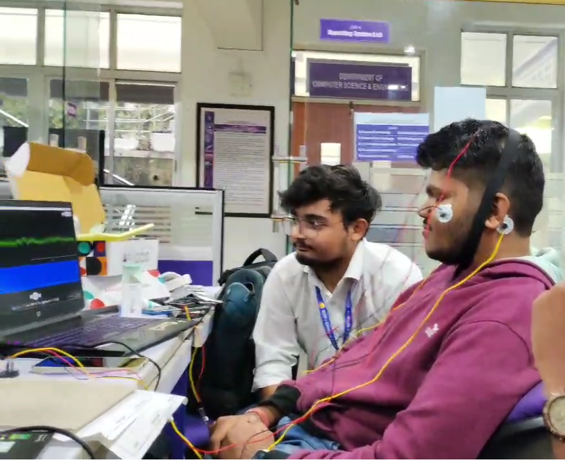
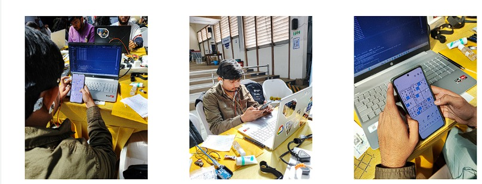
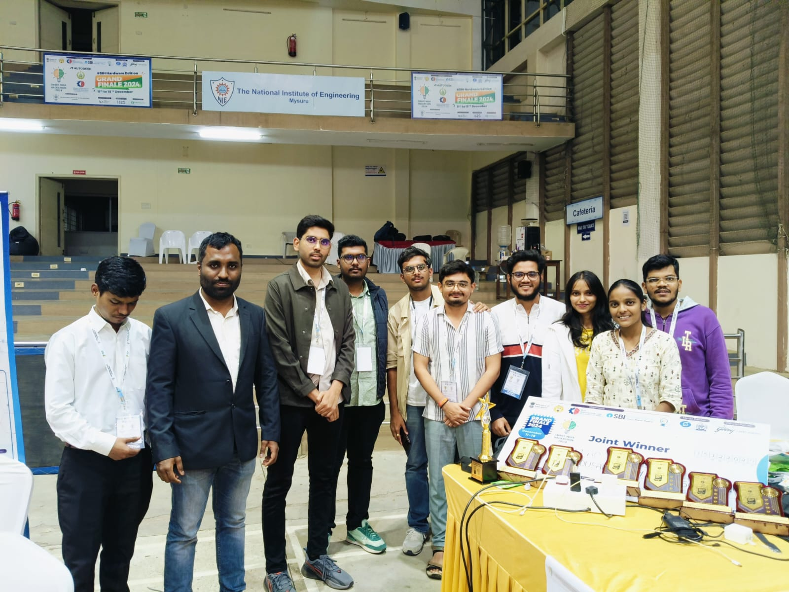
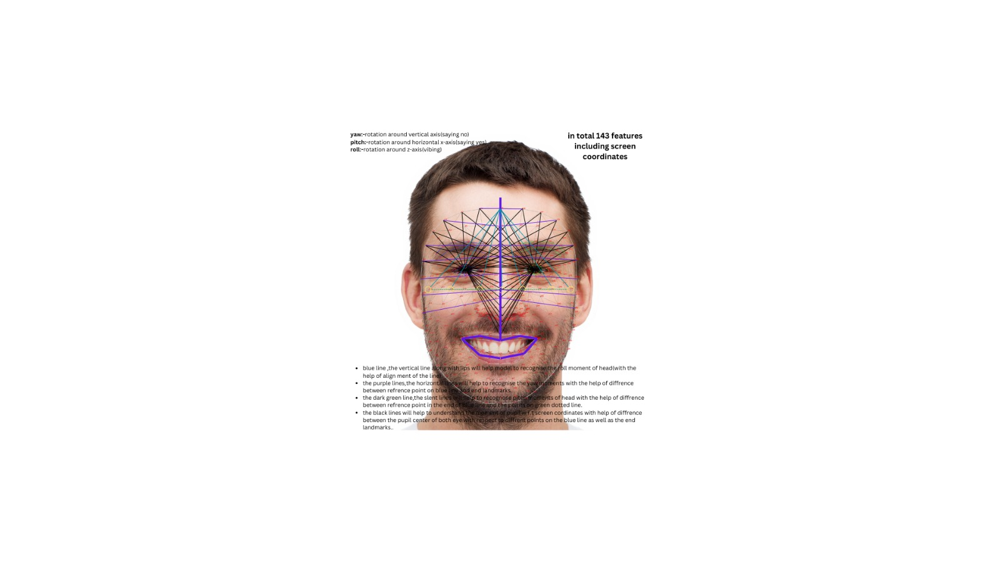
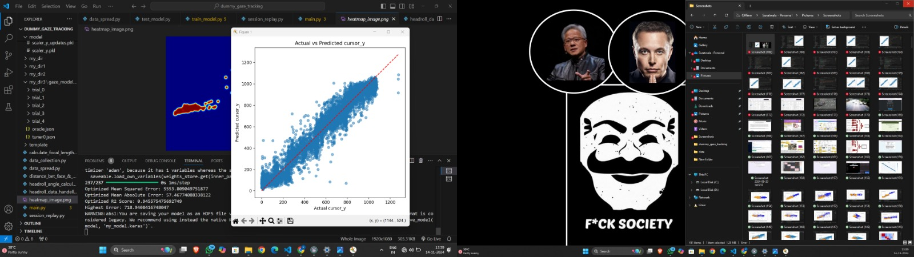
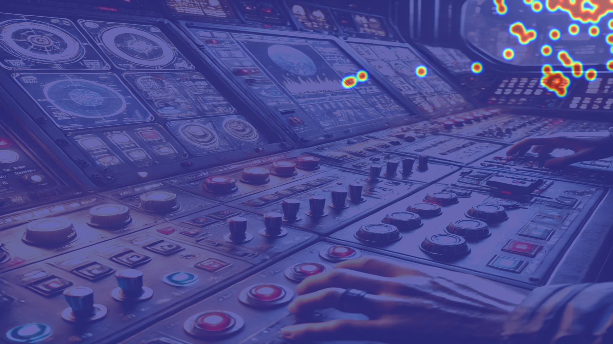

# 🧠 Intelligent Brain Monitoring System

<div align="center">



**An AI-powered multi-modal biomonitoring platform for real-time cognitive and emotional state analysis**

[](https://www.youtube.com/watch?v=6EUc41l48Wg&t=95s)
[](https://www.canva.com/design/DAGYyW3Spqc/Dy1uGgMrLaY6-KinFow0vw/edit)

</div>

---

## 📋 Table of Contents

- [Overview](#-overview)
- [Key Features](#-key-features)
- [System Architecture](#-system-architecture)
- [Technology Stack](#-technology-stack)
- [Applications](#-applications)
- [Installation](#-installation)
- [Usage](#-usage)
- [Module Details](#-module-details)
- [Demo & Screenshots](#-demo--screenshots)
- [Challenges & Solutions](#-challenges--solutions)
- [Future Scope](#-future-scope)
- [Contributing](#-contributing)
- [License](#-license)

---

## 🌟 Overview

The **Intelligent Brain Monitoring System** is an advanced AI-driven platform designed to monitor and support mental and physical well-being in high-stress environments. Originally developed for space missions, this system leverages multi-modal data fusion to provide real-time insights into cognitive states, emotional conditions, and stress levels.

By combining **EEG signal processing**, **eye gaze tracking**, **voice analysis**, and **AI-powered decision support**, the system delivers adaptive recommendations to enhance performance, safety, and well-being.

### 🎯 Primary Use Cases

- **Space Exploration**: Monitor astronaut cognitive load and stress during missions
- **Healthcare**: Track patient mental states for adaptive care and rehabilitation
- **Defense & Aviation**: Support pilots and soldiers during critical operations
- **Industrial Safety**: Monitor workers in high-stress environments
- **Gaming/VR**: Create adaptive experiences based on real-time mental states

---

## ✨ Key Features

### 🔬 Multi-Modal Data Fusion
- **EEG Signal Processing**: Real-time brainwave analysis for concentration and relaxation states
- **Eye Gaze Tracking**: 478-point facial landmark detection with pupil tracking
- **Voice Analysis**: Emotion detection and speech summarization
- **AI Decision Support**: Gemini-powered contextual analysis and recommendations

### ⚡ Real-Time Monitoring
- Continuous tracking of stress, fatigue, and cognitive overload
- Immediate feedback and adaptive recommendations
- Parallel processing of multiple data streams

### 🎨 Intelligent Analysis
- Emotion recognition from voice (happy, fear, sad, anger, neutral)
- EEG-based concentration vs relaxation classification
- Gaze pattern analysis for focus and attention tracking
- Environmental context understanding through image captioning

### 🔧 Modular & Scalable
- Independent modules for easy integration
- Customizable for different environments
- Extensible architecture for additional sensors

---

## 🏗️ System Architecture

```
┌─────────────────────────────────────────────────────────────┐
│                     Data Acquisition Layer                   │
├──────────────┬──────────────┬──────────────┬────────────────┤
│  EEG Sensor  │  Eye Tracker │  Microphone  │  Camera        │
│  (Arduino)   │  (MediaPipe) │  (PyAudio)   │  (OpenCV)      │
└──────┬───────┴──────┬───────┴──────┬───────┴────────┬───────┘
       │              │              │                │
       ▼              ▼              ▼                ▼
┌─────────────────────────────────────────────────────────────┐
│                  Data Processing Layer                       │
├──────────────┬──────────────┬──────────────┬────────────────┤
│ Signal       │ Facial       │ Speech       │ Image          │
│ Processing   │ Landmark     │ Recognition  │ Analysis       │
│ (Scipy)      │ Detection    │ (Google API) │ (Gemini)       │
└──────┬───────┴──────┬───────┴──────┬───────┴────────┬───────┘
       │              │              │                │
       └──────────────┴──────────────┴────────────────┘
                          │
                          ▼
┌─────────────────────────────────────────────────────────────┐
│                    AI Fusion & Analysis                      │
│              (Gemini 1.5 Flash + ML Models)                  │
└──────────────────────────┬──────────────────────────────────┘
                          │
                          ▼
┌─────────────────────────────────────────────────────────────┐
│              Decision Support & Recommendations              │
│           (Interactive Questionnaire & Feedback)             │
└─────────────────────────────────────────────────────────────┘
```

---

## 🛠️ Technology Stack

### Hardware
- **Arduino**: EEG signal acquisition (512 Hz sampling rate)
- **Webcam**: Eye tracking and facial recognition
- **Microphone**: Voice recording and analysis

### Software & Libraries

**Core Processing**
- Python 3.x
- NumPy, SciPy - Signal processing
- Pandas - Data management
- Scikit-learn - Machine learning models

**Computer Vision**
- OpenCV - Image processing
- MediaPipe - Facial landmark detection (478 points)

**Audio Processing**
- PyAudio - Audio recording
- SpeechRecognition - Speech-to-text conversion
- Wave - Audio file handling

**AI & Machine Learning**
- Google Generative AI (Gemini 1.5 Flash)
- Pickle - Model serialization
- Custom trained models for EEG classification

**Additional Tools**
- Serial - Arduino communication
- Threading - Parallel processing
- Keyboard - User input handling

---

## 🎯 Applications

### 🚀 Space Exploration
- Monitor astronaut cognitive load during complex tasks
- Detect early signs of stress and fatigue
- Optimize team coordination and decision-making
- Adaptive task scheduling based on mental states

### 🏥 Healthcare
- Patient mental state monitoring
- Rehabilitation progress tracking
- Adaptive therapy sessions
- Early detection of cognitive decline

### 🛡️ Defense & Aviation
- Pilot stress monitoring during flights
- Soldier cognitive load assessment
- Mission-critical decision support
- Training effectiveness evaluation

### 🏭 Industrial Safety
- Worker fatigue detection in hazardous environments
- Attention monitoring for critical operations
- Accident prevention through early warning
- Productivity optimization

### 🎮 Gaming & VR
- Adaptive difficulty based on player state
- Immersive experience optimization
- Training simulation effectiveness
- User engagement analytics

---

## 📦 Installation

### Prerequisites

```bash
# Python 3.8 or higher
python --version

# Arduino IDE for EEG sensor setup
# Download from: https://www.arduino.cc/en/software
```

### Step 1: Clone the Repository

```bash
git clone <repository-url>
cd brain-monitoring-system
```

### Step 2: Install Python Dependencies

```bash
pip install numpy scipy pandas scikit-learn
pip install opencv-python mediapipe
pip install pyaudio speechrecognition wave
pip install google-generativeai
pip install pyserial keyboard pyautogui
```

### Step 3: Configure API Keys

Create a configuration file or set environment variables:

```python
# In AudioAnalysis/speech.py and GeminiModel files
# Replace with your API key
genai.configure(api_key="YOUR_GEMINI_API_KEY")
```

### Step 4: Arduino Setup

1. Open `Arduino/EEG.ino` in Arduino IDE
2. Connect your EEG sensor to pin A0
3. Upload the sketch to your Arduino board
4. Note the COM port (e.g., COM5)

### Step 5: Update COM Port

```python
# In EEGSignals/eeg.py
ser = serial.Serial('COM5', 115200, timeout=1)  # Update COM port
```

### Step 6: Update Model Paths

```python
# In EEGSignals/eeg.py
# Update paths to your model files
with open(r'path/to/modelfinal.pkl', 'rb') as f:
    clf = pickle.load(f)
with open(r'path/to/scalerfinal.pkl', 'rb') as f:
    scaler = pickle.load(f)
```

---

## 🚀 Usage

### Quick Start

```bash
# Run the complete system
python main.py
```

The system will start three parallel processes:
1. **Eye Gaze Tracking** - Monitors eye movements and attention
2. **Audio Recording** - Captures voice for emotion analysis
3. **EEG Monitoring** - Tracks brain activity

**Press 'q' to stop all recordings**

### Individual Module Testing

```bash
# Test EEG module only
python EEGSignals/eeg.py

# Test eye tracking only
python EyeGazing/eye.py

# Test audio analysis only
python AudioAnalysis/speech.py
```

### System Workflow

1. **Data Collection Phase** (Press 'q' to stop)
   - Eye gaze tracking captures attention patterns
   - Audio recording captures voice
   - EEG sensor monitors brain activity

2. **Processing Phase**
   - Voice converted to text and analyzed for emotion
   - EEG signals classified (Concentration vs Relaxation)
   - Eye gaze data processed for attention metrics

3. **AI Analysis Phase**
   - Gemini AI analyzes environmental context
   - Multi-modal data fusion for comprehensive assessment
   - Personalized questionnaire generation

4. **Interactive Session**
   - AI-powered conversational interface
   - Adaptive recommendations based on analysis
   - Real-time feedback and support

---

## 📚 Module Details

### 1. EEG Signal Processing (`EEGSignals/`)

**Purpose**: Monitor brain activity to classify mental states

**Features**:
- 512 Hz sampling rate via Arduino
- Notch filter (50 Hz) for power line noise removal
- Bandpass filter (0.5-30 Hz) for EEG frequency range
- Welch's method for Power Spectral Density (PSD) analysis
- Feature extraction: Alpha, Beta, Theta, Delta bands
- Real-time classification: Concentration vs Relaxation

**Key Functions**:
```python
setup_filters(sampling_rate)          # Initialize signal filters
process_eeg_data(data, filters)       # Apply filtering
calculate_psd_features(segment, fs)   # Extract frequency features
EEG()                                 # Main monitoring loop
```

**Output**: Classification counts for concentration and relaxation states

---

### 2. Eye Gaze Tracking (`EyeGazing/`)

**Purpose**: Track eye movements and attention patterns using 478 facial landmarks

**Features**:
- MediaPipe Face Mesh for landmark detection
- Pupil center detection (landmarks 468, 473)
- Iris bounding box tracking
- Eye Aspect Ratio (EAR) calculation
- Head pose estimation (Roll, Pitch, Yaw)
- Distance estimation from screen
- Histogram equalization for image enhancement

**Landmark Groups**:
- **Left Eye Iris**: 476, 475, 474, 477
- **Left Pupil Center**: 473
- **Right Eye Iris**: 471, 470, 469, 472
- **Right Pupil Center**: 468

**Key Functions**:
```python
enhance_eye_image(eye_image)          # Histogram equalization
extract_eye_regions(frame, landmarks) # Crop eye regions
save_resized_image(image, path)       # Save processed images
eyeGazing()                           # Main tracking loop
```

**Data Collection Workflow**:

1. **Face Mesh Initialization**: 478 facial landmarks detected in real-time
2. **Pupil Detection**: Exact pupil center and iris bounding box
3. **Relative Positioning**: Calculate distances between pupil and facial landmarks
4. **Eye Aspect Ratio**: Detect blinks and eye openness
5. **Roll Detection**: Head rotation around Z-axis
6. **Yaw Detection**: Head rotation around Y-axis (left-right)
7. **Pitch Detection**: Head rotation around X-axis (up-down)
8. **Image Extraction**: Crop and enhance eye regions
9. **Data Cleaning**: Remove noisy/incomplete data
10. **Distance Estimation**: Calculate face-to-screen distance
11. **Cursor Tracking**: Record gaze-cursor correlation
12. **Dataset Goal**: Collect ~30,000 data points

**Output**: Processed eye images and gaze heatmaps

---

### 3. Voice Analysis (`AudioAnalysis/`)

**Purpose**: Analyze speech for emotion and context extraction

**Features**:
- Real-time audio recording with PyAudio
- Google Speech Recognition for transcription
- Gemini AI for text summarization
- Emotion classification (happy, fear, sad, anger, neutral)
- Context extraction for situational awareness

**Key Functions**:
```python
convert_speech_to_text(audio_file)    # Transcribe audio
summarize(text)                       # Generate summary
emotion(text)                         # Detect emotion
problem(summary, emotion)             # Extract context
ProcessAudio(audio_file)              # Complete pipeline
```

**Audio Settings**:
- Format: 16-bit PCM
- Channels: Mono
- Sample Rate: 44100 Hz
- Chunk Size: 1024 samples

**Output**: Emotion label and contextual keywords

---

### 4. AI Decision Support (`GeminiModel/`)

**Purpose**: Provide intelligent analysis and recommendations

**Components**:

**a) Image Captioning** (`image_caption.py`)
- Analyzes environmental context
- Describes objects and conditions
- Generates detailed scene descriptions

**b) Questionnaire Generation** (`questionnaire.py`)
- Creates personalized questions based on:
  - EEG data (concentration/relaxation)
  - Voice emotion
  - Speech context
  - Environmental conditions

**c) Interactive Session** (`interactive_session.py`)
- Conversational AI interface
- Real-time Q&A
- Adaptive recommendations
- Follow-up question generation

**d) Main Orchestrator** (`test.py`)
- Parallel caption generation
- Data fusion from all modules
- Questionnaire creation
- Session management

**Key Functions**:
```python
generate_image_caption(image, prompt)           # Scene analysis
generate_questionnaire_with_gemini(...)         # Create questions
interactive_questionnaire(questions)            # AI conversation
main(emotion, context, eeg)                     # Orchestrate workflow
```

**Output**: Personalized recommendations and interactive support

---

### 5. Main Controller (`main.py`)

**Purpose**: Orchestrate all modules in parallel

**Features**:
- Multi-threaded execution
- Synchronized data collection
- Unified control (press 'q' to stop all)
- Sequential processing after data collection

**Execution Flow**:
```python
Thread 1: Eye Gaze Tracking  ─┐
Thread 2: Audio Recording     ├─→ Parallel Execution
Thread 3: EEG Monitoring      ─┘
         ↓
    Press 'q' to stop
         ↓
Audio Analysis (emotion + context)
         ↓
EEG Classification (concentration/relaxation)
         ↓
AI Decision Support (Gemini analysis)
         ↓
Interactive Session (recommendations)
```

---

## 📸 Demo & Screenshots

### System in Action

<div align="center">


*Multi-modal data acquisition interface*


*Real-time monitoring dashboard*


*AI-powered analysis results*

</div>

### Eye Gaze Tracking

<div align="center">


*Facial landmark detection with 478 points*


*Pupil tracking and attention heatmap*


*Attention heatmap overlaid on environment*

</div>

### 🎥 Video Demonstration

Watch the complete system demonstration on YouTube:

[](https://www.youtube.com/watch?v=6EUc41l48Wg&t=95s)

---

## 🔧 Challenges & Solutions

### 1. Multi-Modal Data Integration
**Challenge**: Synchronizing data from multiple sensors with different sampling rates

**Solution**: 
- Threaded architecture for parallel data collection
- Unified timestamp system
- Buffer-based data alignment

### 2. Real-Time Processing
**Challenge**: Processing high-frequency EEG data (512 Hz) in real-time

**Solution**:
- Efficient signal processing with SciPy
- Sliding window approach with deque
- Optimized feature extraction pipeline

### 3. Environmental Adaptation
**Challenge**: System reliability in varying lighting and noise conditions

**Solution**:
- Histogram equalization for eye images
- Notch and bandpass filters for EEG
- Robust facial landmark detection with MediaPipe

### 4. Model Accuracy
**Challenge**: Accurate emotion and state classification

**Solution**:
- Multi-modal data fusion
- Pre-trained Gemini AI for context understanding
- Custom trained models for EEG classification

### 5. User Experience
**Challenge**: Non-intrusive monitoring without disrupting workflow

**Solution**:
- Simple keyboard control ('q' to stop)
- Minimal user interaction required
- Automated data processing pipeline

---

## 🚀 Future Scope

### Short-Term (0-6 months)
- [ ] Web-based dashboard for real-time visualization
- [ ] Mobile app integration
- [ ] Cloud storage for historical data
- [ ] Enhanced emotion classification with facial expressions
- [ ] Multi-user support

### Mid-Term (6-12 months)
- [ ] Integration with wearable EEG devices
- [ ] Advanced predictive analytics
- [ ] Customizable alert thresholds
- [ ] API for third-party integrations
- [ ] Deployment in controlled environments (labs, clinics)

### Long-Term (1-3 years)
- [ ] Space mission validation (Low Earth Orbit)
- [ ] FDA approval for medical applications
- [ ] Integration with existing healthcare systems
- [ ] Support for long-duration missions (Mars exploration)
- [ ] Edge computing for offline operation
- [ ] Multi-language support

### Research Directions
- Microgravity adaptation algorithms
- Long-term cognitive trend analysis
- Personalized baseline calibration
- Stress prediction models
- Team dynamics analysis

---

## 🤝 Contributing

We welcome contributions to improve the Intelligent Brain Monitoring System!

### How to Contribute

1. **Fork the repository**
2. **Create a feature branch**
   ```bash
   git checkout -b feature/amazing-feature
   ```
3. **Commit your changes**
   ```bash
   git commit -m 'Add amazing feature'
   ```
4. **Push to the branch**
   ```bash
   git push origin feature/amazing-feature
   ```
5. **Open a Pull Request**

### Contribution Areas

- 🐛 Bug fixes and issue resolution
- ✨ New feature development
- 📝 Documentation improvements
- 🧪 Test coverage expansion
- 🎨 UI/UX enhancements
- 🔬 Research and algorithm optimization

### Code Style

- Follow PEP 8 for Python code
- Add docstrings to all functions
- Include unit tests for new features
- Update documentation as needed

---

## 📄 License

This project is licensed under the MIT License.

```
Copyright (c) 2024 Alpha Century Team

Permission is hereby granted, free of charge, to any person obtaining a copy
of this software and associated documentation files (the "Software"), to deal
in the Software without restriction, including without limitation the rights
to use, copy, modify, merge, publish, distribute, sublicense, and/or sell
copies of the Software, and to permit persons to whom the Software is
furnished to do so, subject to the following conditions:

The above copyright notice and this permission notice shall be included in all
copies or substantial portions of the Software.

THE SOFTWARE IS PROVIDED "AS IS", WITHOUT WARRANTY OF ANY KIND, EXPRESS OR
IMPLIED, INCLUDING BUT NOT LIMITED TO THE WARRANTIES OF MERCHANTABILITY,
FITNESS FOR A PARTICULAR PURPOSE AND NONINFRINGEMENT. IN NO EVENT SHALL THE
AUTHORS OR COPYRIGHT HOLDERS BE LIABLE FOR ANY CLAIM, DAMAGES OR OTHER
LIABILITY, WHETHER IN AN ACTION OF CONTRACT, TORT OR OTHERWISE, ARISING FROM,
OUT OF OR IN CONNECTION WITH THE SOFTWARE OR THE USE OR OTHER DEALINGS IN THE
SOFTWARE.
```

---

## 📞 Contact & Support

### Team Alpha Century

- **Project Lead**: [Your Name]
- **Email**: [your.email@example.com]
- **GitHub**: [github.com/your-username]

### Resources

- 📖 [Full Documentation](https://www.canva.com/design/DAGYyW3Spqc/Dy1uGgMrLaY6-KinFow0vw/edit)
- 🎥 [Video Demo](https://www.youtube.com/watch?v=6EUc41l48Wg&t=95s)
- 💬 [Discussions](https://github.com/your-repo/discussions)
- 🐛 [Issue Tracker](https://github.com/your-repo/issues)

---

## 🙏 Acknowledgments

- **MediaPipe** - Facial landmark detection
- **Google Generative AI** - Gemini 1.5 Flash model
- **SciPy** - Signal processing algorithms
- **OpenCV** - Computer vision tools
- **Arduino Community** - EEG sensor support

---

## 📊 Project Stats

- **Lines of Code**: ~5,000+
- **Modules**: 5 core modules
- **Supported Sensors**: 3 (EEG, Camera, Microphone)
- **AI Models**: 2 (Custom EEG classifier + Gemini)
- **Data Points**: 478 facial landmarks
- **Sampling Rate**: 512 Hz (EEG)

---

<div align="center">

**Built with ❤️ by Team Alpha Century**

⭐ Star this repo if you find it useful!

</div>
